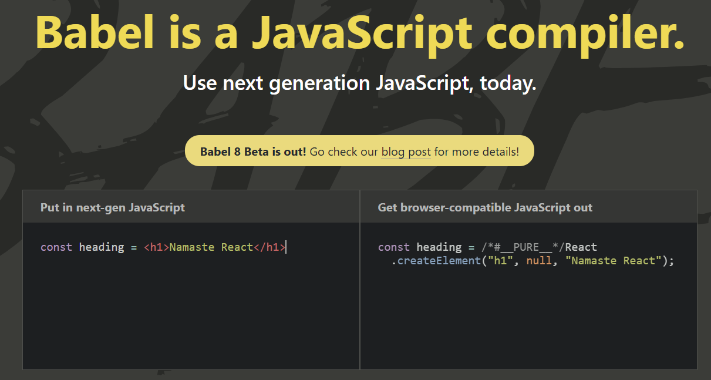

# Namaste React

- Akshay Saini The BEST.

## Finding the Path

Routing can be mysterious, but we'll unravel the secrets in this episode. You'll gain a deep understanding of routes, paths, and how to navigate to different sections of your app with precision.

- [React Router](https://reactrouter.com/) - course V6.4 -> me v7 - `yarn add react-router-dom`
- When building a `web application` with React, `react-router-dom` is the package to use as it provides all the necessary tools for routing in a browser environment. It implicitly includes react-router as a dependency, so you don't need to install both separately.
- For [browser](https://reactrouter.com/start/data/custom)
  - The browser runtime API that enables [route module](https://reactrouter.com/start/data/custom#client-rendering) APIs (loaders, actions, etc.) is `createBrowserRouter`.
  - To render the router in the browser, use `<RouterProvider>`
- Now we want to keep our header intact and change pages below it accordingly.- we use [outlet](https://reactrouter.com/api/components/Outlet#outlet)
- use [Link which is a wrapper to `<a href>`](https://reactrouter.com/api/components/Link#link) to be able to navigate from the client-side.never ever use anchor tag. navigate to new page without reloading the page.
- Dynamic routing & different pages for different restaurants. - useParams()

## Exploring the World

Navigation is essential, and in this episode, we delve into React routing. You'll learn how to navigate seamlessly within your app, creating a smooth and user-friendly experience.

- In here we will see how we can fetch dynamically data from API & populate our page dynamically.
- Add this [Allow CORS extension](https://chromewebstore.google.com/detail/lhobafahddgcelffkeicbaginigeejlf?utm_source=item-share-cb) in chrome.
- [Shimmer UI](https://medium.com/lattice-what-is/shimmer-ui-a-better-way-to-show-loading-states-aa1f4e563d17) instead of spinner or loading... update
- Adding a search functionality.
- add this chrome extension - [JSON Viewer](https://chromewebstore.google.com/detail/aimiinbnnkboelefkjlenlgimcabobli?utm_source=item-share-cb)
- [Cors Proxy](https://corsproxy.io/) helps you to by-pass cors error. [Refer docs](https://corsproxy.io/docs/getting-started)

## Let's Get Hooked

- Let's clean our app a bit from previous lecture as it contains lot of code in `App.js`(Everything into single file - not good practice to keep large files in our app) & then proceed with `React Hooks`
- **Types of Export/Import**
  - Default:
    - export default Component;
    - import Component from "path";
  - Named:
    - export const NAME;
    - import {NAME} from "path";
    - When you want to export multiple things from a file use `Named` exports
  - Note: Yes, it is possible to use both default and named exports within the same file in a React application, as this is a standard JavaScript module feature.
    - Key points:
      - Default Export: A module can only have one default export. It is often used to export the primary component or value from a file. When importing a default export, you can give it any name you choose and do not use curly braces.
      - Named Exports: A module can have multiple named exports. These are used to export specific variables, functions, or components. When importing named exports, you must use curly braces and import them by their exact names (or use an alias).

```js
// MyComponents.js
export const AnotherComponent = () => {
  return <div>Another Component</div>;
};

const MyComponent = () => {
  return <div>Hello World</div>;
};

export default MyComponent;

// App.js
import MyComponent, { AnotherComponent } from './MyComponents';

function App() {
  return (
    <div>
      <MyComponent />
      <AnotherComponent />
    </div>
  );
}

export default App;

```

- React Hooks:

## Talk is cheap - Show me the code

- let's build a food ordering App. And to code let's get rid of previous code and start from scratch again - review commits of what we learned later.

## Laying the Foundation - babel, JSX

```text
let's start from scratch
Some revision info below
create React Element - it's not an html element - Behind the scenes - creates an Object
when we render this element on to the DOM - then it becomes a HTML element
const heading = React.createElement("h1",{id:"heading"},"Hello World from Namaste React!!!")
create Root
const root = ReactDOM.createRoot(document.getElementById("root"));
render h1 tag
root.render(heading);
The above way is s not clean  - syntax is very bad - can we do better on elements - as this is
not developer friendly - to address this facebook developers came up with a new syntax called JSX
JSX - javascript syntax to create react elements
it looks similar to HTML but it's not HTML
Also react is different and JSX is different - JSX is just a syntax sugar for React.createElement
let's create a JSX for h1
const jsxHeading = <h1 id="heading">Hello World from Namaste React!!! using JSX</h1>; - this is not pure js but it is js
jsxHeading is a React Element
jsx is not html inside javascript - it's a html like syntax
From here onwards on we will use JSX to create our React elements not React.createElement.
JSX - transpiled before it reaches to JS Engine on Browser - transpiling is done by parcel
- which is a bundler and it's babel job(Part of parcel) to do transpiling
(JSX - converts into browsers understandable JS code - React.createElement("h1",{id:"heading"},"Hello World from Namaste React!!!"))
- babel is not created by Facebook
- babel is converting jsx to react.createElement
```

- [babel](https://babeljs.io/) a javascript compiler. babel does a lot of transpilation for all types of browser.
  

- Extensions to Install via VS Code:

  - Prettier
  - Bracket Pair Colorization Toggler
  - Better Comments

- React components

## [Parcel](https://parceljs.org/)

- Created a dev build
- Created a local server
- Also automatically updating the new content on to the browser (HMR - Hot Module Replacement)
- Parcel uses a file watching algorithm written in c++
- Caching - Faster Builds
- Does Image optimization
- Minification of our files - bundle it for production.
- Compress our file - so we can ship smaller versions well.
- Uses consistent hashing.
- Does code splitting
- Does differential bundling (bundles for different browsers .etc - support older browsers)
- Parcel gives beautiful error views - does Diagnostics - Good error handling and suggestions
- Gives a way to host it on https.
- Falling in Love with Parcel - Read ABout it more in docs.
- Tree Shaking - remove unused code for you - it will minification and compression of that part - makes our experience faster.
- Read Docs More - Be curios.
- different build for dev & prod bundles. & faster because it used cache.
- Browsers list - [reference](https://browserslist.dev/?q=bGFzdCAyIHZlcnNpb25z) - A powerful tool.
